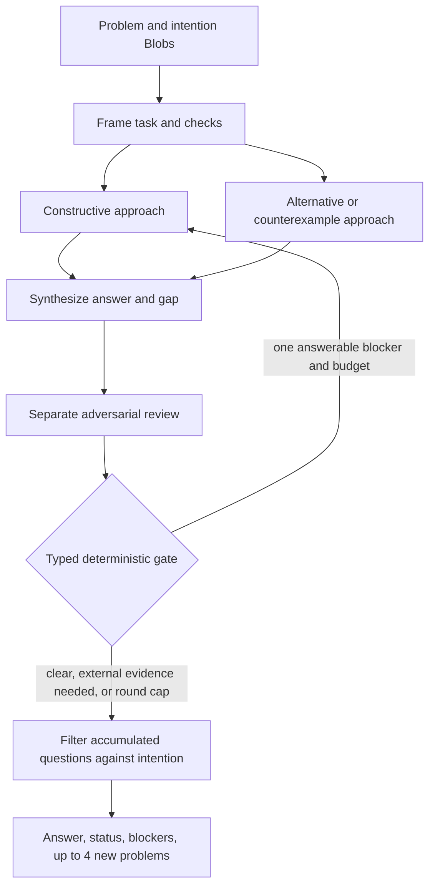

# A bounded problem-solving kernel

**Status:** proposal only. This adds no executable workflow.

The workflow should turn a supplied subproblem into the best answer it can support, while keeping a short frontier of new problems whose answers could add information toward a separate, possibly much harder intention.

```text
(problem Blob, intention Blob)
    -> (answer, answer status, open blockers, intention-relevant new problems)
```

## Small typed contract

```text
KernelInput {
  problem: Blob
  intention: Blob
}

FollowUpProblem {
  question: string
  intention_target: string
  expected_new_information: string
  origin: string
  uncertainty: string
}

KernelOutput {
  answer: string
  status: locally_checked | provisional | unresolved
  open_blockers: seq[string]
  new_problems: seq[FollowUpProblem]  # at most 4
}
```

The intention guides relevance; it does not silently replace the assigned problem. “Locally checked” means the answer met the stated checks and the separate reviewer found no decisive gap within the supplied material. It is not proof. Use provisional when evidence, interpretation, or a needed external check is missing; use unresolved when no adequate answer emerged. Never let a model confidence score alone declare the problem solved.

## Graph



1. **Frame once (Luna medium).** Read both Blobs. Return a compact working statement, at most three completion checks for the assigned problem, and at most three explicit targets or unknowns from the intention. Preserve ambiguity as ambiguity; do not invent acceptance criteria.
2. **Make two distinct attempts (parallel, Luna low).** Each receives the original problem Blob, the compact frame, and the current active work item. One constructs a direct solution from the stated facts. The other tries a different decomposition, tests a key assumption, and looks for a counterexample or boundary case. Each returns a concise candidate, its key support/assumption, its main uncertainty, and at most one new problem. Avoid long private reasoning traces.
3. **Synthesize (Luna high).** Reconcile agreement and disagreement into one best answer. State the decisive support and unresolved blockers. Select at most one repair target only when it is a blocker to answering the assigned problem and appears answerable from the supplied material. Add at most two intention-linked problem candidates to the ledger.
4. **Review (separate Luna xhigh call).** Check the answer against the original problem Blob, frame’s completion checks, and both attempts. Seek a decisive counterexample, omitted condition, or unsupported step. Return a typed route: clear, one actionable blocker, or external/unclear dependency. This is an adversarial prompt, not an independent oracle.
5. **Route with deterministic `so`/`so_budget`.** Permit at most two solve rounds total: the original attempt plus one targeted retry. Retry only a single answerable blocker, and only if enough global budget remains for a full round and final question filter. Otherwise stop and preserve the best answer as provisional or unresolved. The callback reads only typed state and the budget snapshot; it makes no model calls, file access, or side effects, and returns the same graph when replayed on resume. The state machine, not model text, enforces the cap.
6. **Filter questions once (Luna medium).** Review the compact accumulated ledger against the original intention Blob. Keep a candidate only if it names an intention target, explains what distinct information solving it could reveal, and says how that information could change progress or a decision toward the intention. Reject candidates that only restate the assigned problem or answer. Deduplicate and return at most four. “Interesting” or topical alone is insufficient.

The active retry target is a blocker to the current problem. The question ledger is a future frontier: those questions are returned for later work, never recursively solved in this run. Keep their origin and uncertainty so a question is not mistaken for an established fact. Cap the ledger at eight entries and mark it incomplete if candidates were dropped.

## Calls, budget, and local fit

The graph schedules at most ten model nodes: one frame, two rounds of two approaches plus synthesis and review, and one final filter. A clean early stop uses six. Set `finish_work_retry_limit=1` to allow at most one missing-submission follow-up turn per node. The 6–10 node count is the workflow’s enforceable call cap; the Vecherinka budget does not cap schema-correction exchanges or transport retries, so it cannot guarantee a literal provider-request ceiling of twenty.

Using the repository’s fixed Luna costs, the maximum estimate is:

| Work | Count and effort | Fixed estimate |
|---|---:|---:|
| Frame | 1 medium | 0.61 |
| Two solve rounds | 2 × (2 low + 1 high + 1 xhigh) | 6.12 |
| Final question filter | 1 medium | 0.61 |
| **Maximum** | **10 model nodes** | **7.34 units** |

An initial budget of 7.5 units covers the declared graph with a small margin. These are fixed admission estimates, not measured provider spend. Keep model outputs compact and typed; the SQLite run database remains the durable artifact/checkpoint store. Existing DSL forms fit: `fan` for the two attempts, fixed `>>>` composition for synthesis/review, and bounded `so` routing for the one retry.

The first version should reason only from the two supplied Blobs and model knowledge. The workflow itself configures no retrieval or execution tools. If the problem depends on current facts, unavailable evidence, tests, or an external oracle, report that dependency; do not imply it was checked.

## Why this shape

- **Bounded search:** Tree of Thoughts shows how branching over coherent candidate states and evaluating them can help on search-heavy tasks. This proposal borrows a fixed width of two and one return edge; a full tree’s repeated proposal/evaluation calls exceed the intended budget. [Yao et al., *Tree of Thoughts* (2023)](https://arxiv.org/abs/2305.10601)
- **Merge, not open-ended graph:** Graph of Thoughts motivates combining dependent candidate outputs. Here the graph is a small diamond plus one capped retry, not arbitrary topology. [Besta et al., *Graph of Thoughts* (2023)](https://arxiv.org/abs/2308.09687)
- **Do not rely on self-critique alone:** Self-Refine reports gains on its evaluated tasks, while later evaluation finds intrinsic self-correction can fail or degrade reasoning without external feedback. The separate reviewer is therefore a fallible challenge step; status stays scoped and uncertainty stays visible. [Madaan et al., *Self-Refine* (2023)](https://arxiv.org/abs/2303.17651); [Huang et al., *LLMs Cannot Self-Correct Reasoning Yet* (ICLR 2024)](https://arxiv.org/abs/2310.01798)
- **Choose questions for information, not topicality:** Uncertainty of Thoughts selects questions by expected information gain in diagnosis and troubleshooting settings. This kernel adopts only the qualitative test—what uncertainty the answer reduces and how that matters to the intention—because simulated probabilities and lookahead would be costly and uncalibrated here. [Hu et al., *Uncertainty of Thoughts* (NeurIPS 2024)](https://arxiv.org/abs/2402.03271)
- **Hard budget over claimed optimal allocation:** Test-time compute studies find that useful solve/verify allocations depend on task difficulty and budget. A recent taxonomy also distinguishes sequential deliberation, candidate sampling with reduction, and partial-state search; this proposal identifies its fixed branch-and-merge protocol and counts nodes separately from completion turns. The studies do not establish one best allocation for arbitrary Blob problems, so this proposal uses a transparent cap and claims no optimal search policy. [Snell et al. (2024)](https://arxiv.org/abs/2408.03314); [Singhi et al. (COLM 2025)](https://arxiv.org/abs/2504.01005); [Hariri et al. (2026)](https://arxiv.org/abs/2608.04001)

## Main limitation

All semantic gates use the same Luna model family and may share blind spots. Without supplied evidence, a deterministic checker, retrieval, execution, or human review, the workflow cannot certify correctness or that a follow-up truly advances a hard intention. It can return a concise, inspectable provisional answer and explain the information value claimed for each next problem. The current Vecherinka run loop has no deadline or cancellation API, so the node and budget caps do not bound wall-clock time if a model call stalls; an external supervisor would be needed for that limit.
